[](https://www.npmjs.com/package/maplibre-versatiles-styler)
[](https://www.npmjs.com/package/maplibre-versatiles-styler)
[](https://github.com/versatiles-org/maplibre-versatiles-styler/releases/latest)
[](https://codecov.io/gh/versatiles-org/maplibre-versatiles-styler)
[](https://github.com/versatiles-org/maplibre-versatiles-styler/actions/workflows/ci.yml)
[](LICENSE)

# MapLibre VersaTiles Styler

A lightweight MapLibre GL JS control that allows users to explore and modify **VersaTiles map styles** directly inside the map.
It provides a sidebar that edits every option of [`@versatiles/style`](https://github.com/versatiles-org/versatiles-style) v6 — themes, colors, fonts, layers, terrain, sky and more — and exports the result as a `style.json` or as code.
Perfect for data journalism, demos, prototyping, or interactive style exploration.

---

## Features

- Interactive styling UI directly inside MapLibre
- Ten vector themes — `colorful`, `natural`, `muted`, `gray`, `toner`, each with a `-dark` variant — and satellite imagery
- Sections grouped the way a style is made: style, content, appearance, scene, setup
- Show, hide or fade every layer group; 3D buildings
- Colors: global adjustments (hue, saturation, brightness, contrast, gamma, tint, blend) and every individual color, grouped by feature — with a color picker (RGB, HSL, hex, transparency) that updates the map while you drag
- Labels in any language of the tileset, or in the browser's language; tilt of line labels
- Label style for all labels, a group or a topic (places, streets, water, …): font, size, spacing, capitalization, letter spacing, line height, wrap width and halo — with a font picker that previews each family, filters by writing system and warns when a font lacks the letters of the label language
- Icon size and spacing
- Inspector: click a feature on the map to see which style layer drew it, which layer group and label
  topic it belongs to, and which color it was painted with — and change that color or hide the group
  right there
- Terrain and hillshade, projection (globe, Mercator), sky and sun
- Satellite: imagery adjustments and a fully configurable vector overlay (theme, colors, labels, icons, layers)
- The whole configuration is kept in the URL hash, so a styled map can be shared as a link
- Export dialog with a preview and syntax highlighting: `style.json` (readable or minified) and the
  `@versatiles/style` code for an npm project or a plain HTML page
- Import dialog: paste or drop a styler link, a `style.json`, its address, or an options object —
  warnings are shown before anything is applied
- Panel header with Reset all (undoable)
- Dark panel and pickers on dark themes and satellite
- Works as a standard MapLibre control (`map.addControl`)
- CSS is injected automatically — no separate stylesheet needed
- Written in TypeScript, bundled with Vite

Requires MapLibre GL JS 6 or later: the styles it builds use paint properties (such as
`line-layer-opacity`) that earlier versions reject.

---

## Usage

### ES module (recommended)

```bash
npm install maplibre-versatiles-styler
```

```js
import * as maplibregl from 'maplibre-gl';
import VersaTilesStylerControl from 'maplibre-versatiles-styler';

const map = new maplibregl.Map({
  container: 'map',
});

map.addControl(new VersaTilesStylerControl({ open: true }));
```

### UMD / script tag

```html
<!DOCTYPE html>
<html>
<head>
  <meta charset="utf-8" />
  <title>MapLibre VersaTiles Styler Demo</title>

  <!-- MapLibre: version 6 ships as an ES module only, so it is imported below -->
  <link href="https://unpkg.com/maplibre-gl/dist/maplibre-gl.css" rel="stylesheet" />

  <!-- VersaTiles Styler -->
  <script src="https://unpkg.com/maplibre-versatiles-styler" defer></script>

  <style>
    body, html { margin: 0; padding: 0; height: 100%; }
    #map { width: 100%; height: 100%; }
  </style>
</head>

<body>
  <div id="map"></div>
  <script type="module">
    import * as maplibregl from "https://unpkg.com/maplibre-gl/dist/maplibre-gl.mjs";

    window.addEventListener("DOMContentLoaded", () => {
      const map = new maplibregl.Map({
        container: "map",
      });

      map.addControl(
        new VersaTilesStylerControl({ open: true }),
        "top-left"
      );
    });
  </script>
</body>
</html>
```

When using the UMD build, the control is available as the global `VersaTilesStylerControl`.

---

## Options

The `VersaTilesStylerControl` constructor accepts an optional config object:

| Option   | Type      | Default                  | Description                                                               |
| -------- | --------- | ------------------------ | ------------------------------------------------------------------------- |
| `origin` | `string`  | `window.location.origin` | Base URL of the VersaTiles server. Can also be changed in the sidebar.    |
| `open`   | `boolean` | `false`                  | Whether the sidebar is open initially, unless the URL hash says otherwise |
| `hash`   | `boolean` | `true`                   | Keep the map view, the style and its options in the URL hash fragment     |

---

## Server requirements

The styler reads everything from the `origin`. Each of these is optional — what is missing is left out of the sidebar:

| Path                                     | Used for                                                          |
| ---------------------------------------- | ----------------------------------------------------------------- |
| `/tiles/osm/tiles.json`                  | The vector themes and the satellite overlay; languages; landcover |
| `/tiles/satellite/tiles.json`            | The satellite style                                               |
| `/tiles/elevation/tiles.json`            | Terrain and hillshade                                             |
| `/assets/glyphs/{fontstack}/{range}.pbf` | Label fonts                                                       |
| `/assets/glyphs/font_families.json`      | The font lists; without it, fonts are entered as glyph names      |
| `/assets/sprites/base`                   | Icons                                                             |

The three TileJSON files are loaded in parallel when the control is added, and the style is set once they are in.

---

## Export and import

**Export** is the button in the panel header. It opens a dialog with two tabs:

| Tab          | What it gives you                                                                                  |
| ------------ | -------------------------------------------------------------------------------------------------- |
| `style.json` | The finished style as a file, readable or minified. Sources are inlined, so it needs nothing else. |
| Code         | The `@versatiles/style` snippet that builds this style — for an npm project, or a plain HTML page. |

An exported `style.json` records the options it was built from under `metadata["versatiles:options"]`,
so importing the file again restores those settings exactly rather than approximating them.

**Import** is in the sidebar's *Setup* group. It takes, and tells apart on its own:

- a styler link — the page URL, whose hash carries the whole configuration, or just the `#…` part of it,
- a `style.json` — pasted, dropped as a file, or as a URL,
- a `@versatiles/style` options object, e.g. `{"theme": "gray", "text": {"scale": 1.5}}`.

A style this styler wrote comes back exactly. Any other MapLibre style — built for OpenMapTiles,
Protomaps or Shortbread tiles — is reconstructed by `@versatiles/style/migrate`, which works out what the
style draws and finds the closest options. That is a close copy rather than the original, and whatever
could not be carried over is listed before you apply it. Nothing is applied until you press **Apply**.

Options that are not valid are refused with the library's own explanation, which names the offending key,
lists the keys valid in its place, and translates v5 names into their v6 replacements.

---

## URL hash

With `hash: true` the styler keeps its state in the URL:

```
#map=<zoom>/<lat>/<lng>[/<bearing>/<pitch>]&panel=<open or closed>&style=<theme or satellite>&config=<options>
```

`config` is the base64url-encoded JSON of the options that differ from the theme's defaults — the same
options `@versatiles/style` takes, e.g. `{"layers":{"labels":false}}`.

`panel` says whether the sidebar is open; it appears only when it differs from the `open` option, so a
link shows the sidebar as it was left.

---

## Upgrading from 1.x

Version 2 is built on `@versatiles/style` v6:

- The v5 styles `eclipse`, `graybeard`, `neutrino` and `shadow` are replaced by themes. Links that use them
  open the closest theme (`colorful-dark`, `gray`, `muted`, `gray-dark`).
- Options stored in older links use v5 option names; they are ignored and the theme's defaults are shown.
  Pasting such options into **Import** explains each renamed key instead of ignoring it.
- The copied code uses the v6 API: `await inlineSources(osm({ theme, … }))`.
- Export moved from a dropdown in the header into a dialog, and gained an import counterpart.
- `/tiles/index.json` is no longer read; sources are detected from their TileJSON files (see above).

## Development

`src/lib` is grouped by topic: `style/` builds the style from the options, `options/` holds the models
the sidebar sections edit, `fonts/` everything about faces and glyphs, `transfer/` a style in and out
(import, export, the URL hash), `browser/` the adapters to the page and the map, and `components/` the
Svelte UI. `control.ts` is what `src/index.ts` exports, and the only entry point.

### Dependency Graph

<!--- This chapter is generated automatically --->

[](assets/dependency-graph.svg?raw=true)
